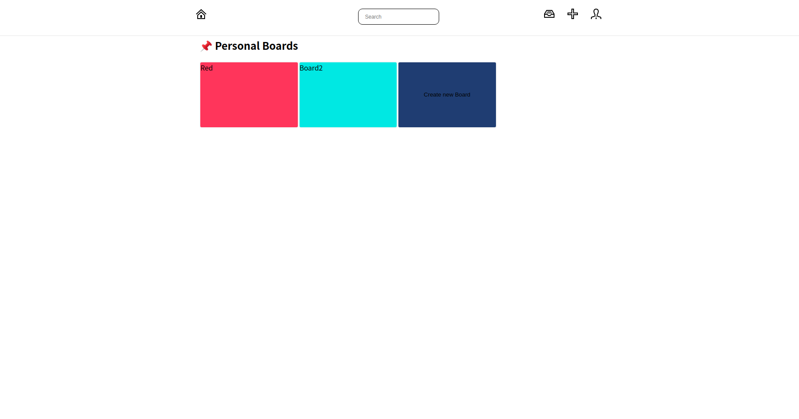
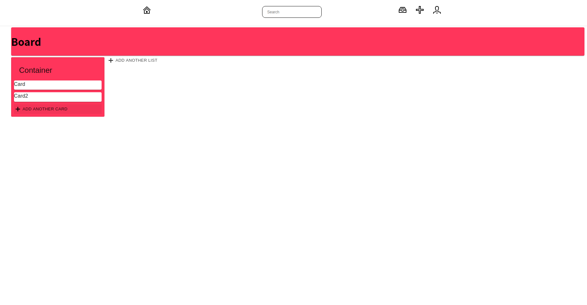

# Trello Clone

#### Install

```js
$ npm(yarn) install
```

#### Start

## 1. Project

개발자 공부를 위해 트렐로 클론을 해 보는 프로젝트입니다.

### 서비스 시연 IMG 모음

- Intro / - profile
<div>


</div>

- Main

<div>


</div>

- Board / Contaienr /Card

<div>


</div>

### 서비스 시연 링크

- https://youtu.be/JPywnV79jio
